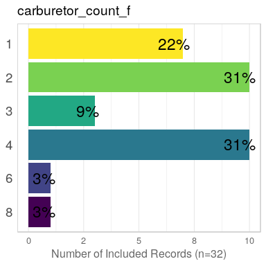
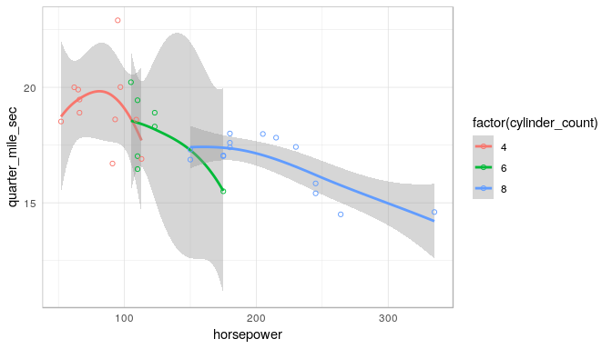
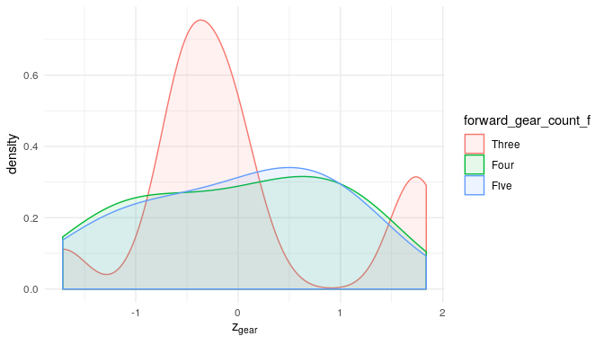

# Skeleton Report 1
Date: `r Sys.Date()`  

This report covers the analyses used in the ZZZ project (Marcus Mark, PI).

<!--  Set the working directory to the repository's base directory; this assumes the report is nested inside of two directories.-->


<!-- Set the report-wide options, and point to the external code file. -->


<!-- Load the sources.  Suppress the output when loading sources. --> 


<!-- Load 'sourced' R files.  Suppress the output when loading packages. --> 


<!-- Load any global functions and variables declared in the R file.  Suppress the output. --> 


<!-- Declare any global functions specific to a Rmd output.  Suppress the output. --> 


<!-- Load the datasets.   -->


<!-- Tweak the datasets.   -->


# Summary

### Notes 
1. The current report covers 32 cars, with 6 possible values for `carburetor_count`.
1. The Seattle track's phluguerstometer was producing flaky negative values; it's measurements have been dropped.

### Unanswered Questions
1. What does `VS` stand for?  How was it measured?
1. Where the cars at the Philly track measured with the same phluguerstometer and the Cleveland track?
 
### Answered Questions
1. The Seattle track's phluguerstometer was producing flaky negative values; it's measurements have been dropped.

# Marginals
<!-- --><!-- --><!-- --><!-- -->

# Scatterplots
<!-- --><!-- --><!-- --><!-- --><!-- -->

```
Warning in simpleLoess(y, x, w, span, degree = degree, parametric = parametric, : span too small.
fewer data values than degrees of freedom.
```

```
Warning in simpleLoess(y, x, w, span, degree = degree, parametric = parametric, : Chernobyl! trL>n 3

Warning in simpleLoess(y, x, w, span, degree = degree, parametric = parametric, : Chernobyl! trL>n 3
```

```
Warning in sqrt(sum.squares/one.delta): NaNs produced
```

```
Warning in predLoess(object$y, object$x, newx = if (is.null(newdata)) object$x else if
(is.data.frame(newdata)) as.matrix(model.frame(delete.response(terms(object)), : span too small.
fewer data values than degrees of freedom.
```

```
Warning in stats::qt(level/2 + 0.5, pred$df): NaNs produced
```

<!-- --><!-- -->

# Models

```
============= Simple model that's just an intercept. =============
```

```

Call:
lm(formula = quarter_mile_in_seconds ~ 1, data = ds)

Residuals:
    Min      1Q  Median      3Q     Max 
-3.3487 -0.9563 -0.1387  1.0512  5.0512 

Coefficients:
            Estimate Std. Error t value Pr(>|t|)
(Intercept)  17.8488     0.3159    56.5   <2e-16

Residual standard error: 1.787 on 31 degrees of freedom
```

```
============= Model includes one predictor. =============
```

```

Call:
lm(formula = quarter_mile_in_seconds ~ 1 + miles_per_gallon, 
    data = ds)

Residuals:
    Min      1Q  Median      3Q     Max 
-2.8161 -1.0287  0.0954  0.8623  4.7149 

Coefficients:
                 Estimate Std. Error t value Pr(>|t|)
(Intercept)      15.35477    1.02978  14.911 2.05e-15
miles_per_gallon  0.12414    0.04916   2.525   0.0171

Residual standard error: 1.65 on 30 degrees of freedom
Multiple R-squared:  0.1753,	Adjusted R-squared:  0.1478 
F-statistic: 6.377 on 1 and 30 DF,  p-value: 0.01708
```

```
The one predictor is significantly tighter.
```

```
Analysis of Variance Table

Model 1: quarter_mile_in_seconds ~ 1
Model 2: quarter_mile_in_seconds ~ 1 + miles_per_gallon
  Res.Df    RSS Df Sum of Sq      F  Pr(>F)
1     31 98.988                            
2     30 81.636  1    17.352 6.3767 0.01708
```

```
============= Model includes two predictors. =============
```

```

Call:
lm(formula = quarter_mile_in_seconds ~ 1 + miles_per_gallon + 
    forward_gear_count_f, data = ds)

Residuals:
    Min      1Q  Median      3Q     Max 
-2.0370 -0.5882 -0.1602  0.5428  4.1646 

Coefficients:
                         Estimate Std. Error t value Pr(>|t|)
(Intercept)              15.55851    0.89782  17.329  < 2e-16
miles_per_gallon          0.13246    0.05164   2.565 0.015963
forward_gear_count_fFour  0.15680    0.66819   0.235 0.816173
forward_gear_count_fFive -2.75051    0.72888  -3.774 0.000768

Residual standard error: 1.309 on 28 degrees of freedom
Multiple R-squared:  0.5151,	Adjusted R-squared:  0.4632 
F-statistic: 9.916 on 3 and 28 DF,  p-value: 0.0001272
```

```
The two predictor is significantly tighter.
```

```
Analysis of Variance Table

Model 1: quarter_mile_in_seconds ~ 1 + miles_per_gallon
Model 2: quarter_mile_in_seconds ~ 1 + miles_per_gallon + forward_gear_count_f
  Res.Df    RSS Df Sum of Sq      F    Pr(>F)
1     30 81.636                              
2     28 47.996  2     33.64 9.8124 0.0005896
```

# Result table for model with two predictors

|                         | Estimate| Std. Error| t value| Pr(>&#124;t&#124;)|
|:------------------------|--------:|----------:|-------:|------------------:|
|(Intercept)              |    15.56|       0.90|   17.33|               0.00|
|miles_per_gallon         |     0.13|       0.05|    2.57|               0.02|
|forward_gear_count_fFour |     0.16|       0.67|    0.23|               0.82|
|forward_gear_count_fFive |    -2.75|       0.73|   -3.77|               0.00|

<!--html_preserve--><div id="htmlwidget-a1b41485423029b78e63" style="width:100%;height:auto;" class="datatables html-widget"></div>
<script type="application/json" data-for="htmlwidget-a1b41485423029b78e63">{"x":{"filter":"none","data":[["(Intercept)","miles_per_gallon","forward_gear_count_fFour","forward_gear_count_fFive"],[15.56,0.13,0.16,-2.75],[0.9,0.05,0.67,0.73],[17.33,2.57,0.23,-3.77],[0,0.02,0.82,0]],"container":"<table class=\"display\">\n  <thead>\n    <tr>\n      <th> \u003c/th>\n      <th>Estimate\u003c/th>\n      <th>Std. Error\u003c/th>\n      <th>t value\u003c/th>\n      <th>Pr(&gt;|t|)\u003c/th>\n    \u003c/tr>\n  \u003c/thead>\n\u003c/table>","options":{"pageLength":2,"columnDefs":[{"className":"dt-right","targets":[1,2,3,4]},{"orderable":false,"targets":0}],"order":[],"autoWidth":false,"orderClasses":false,"lengthMenu":[2,10,25,50,100]}},"evals":[],"jsHooks":[]}</script><!--/html_preserve-->

**In the model that includes two predictors, the slope coefficent of `Miles per gallon` is 0.13246.**


# Session Information
For the sake of documentation and reproducibility, the current report was rendered on a system using the following software.

```
Report rendered by wibeasley at 2016-09-16, 10:21 -0400 in 5 seconds.
```

```
R version 3.3.1 (2016-06-21)
Platform: x86_64-pc-linux-gnu (64-bit)
Running under: Ubuntu 14.04.5 LTS

locale:
 [1] LC_CTYPE=en_US.UTF-8       LC_NUMERIC=C               LC_TIME=en_US.UTF-8       
 [4] LC_COLLATE=en_US.UTF-8     LC_MONETARY=en_US.UTF-8    LC_MESSAGES=en_US.UTF-8   
 [7] LC_PAPER=en_US.UTF-8       LC_NAME=C                  LC_ADDRESS=C              
[10] LC_TELEPHONE=C             LC_MEASUREMENT=en_US.UTF-8 LC_IDENTIFICATION=C       

attached base packages:
[1] stats     graphics  grDevices utils     datasets  methods   base     

other attached packages:
[1] ggplot2_2.1.0 knitr_1.14   

loaded via a namespace (and not attached):
 [1] Rcpp_0.12.7        magrittr_1.5       munsell_0.4.3      colorspace_1.2-6   R6_2.1.3          
 [6] highr_0.6          stringr_1.1.0      plyr_1.8.4         dplyr_0.5.0.9000   tools_3.3.1       
[11] DT_0.2             grid_3.3.1         gtable_0.2.0       DBI_0.5            htmltools_0.3.5   
[16] yaml_2.1.13        lazyeval_0.2.0     digest_0.6.10      assertthat_0.1     tibble_1.2        
[21] RColorBrewer_1.1-2 formatR_1.4        htmlwidgets_0.7    evaluate_0.9       rmarkdown_1.0     
[26] labeling_0.3       stringi_1.1.1      scales_0.4.0       jsonlite_1.0      
```
